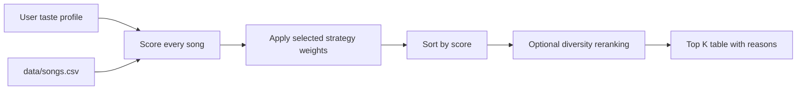

# 🎵 VibeCompass — Music Recommender Simulation

## Project Summary

VibeCompass is a CLI-first, content-based music recommender. It compares a user's stated taste profile with a catalog of 20 songs, gives every song a weighted similarity score, explains the score, and ranks the strongest matches. The system also includes four switchable scoring modes and an optional diversity reranker that reduces repeated artists and genres.

Real platforms commonly combine **collaborative filtering** (patterns from users with similar listening behavior) with **content-based filtering** (song features such as genre, tempo, mood, and energy). They may also learn from likes, skips, replays, playlist additions, search activity, listening duration, and context. VibeCompass intentionally uses only content-based rules so that every result remains easy to inspect and explain.

## How the System Works

### Data flow



### Song features

Each song contains the starter attributes:

- `genre`, `mood`, `energy`, `tempo_bpm`
- `valence`, `danceability`, and `acousticness`

The advanced-feature extension adds seven attributes:

- `popularity` (0–100)
- `release_year`
- `instrumentalness` (0.0–1.0)
- `speechiness` (0.0–1.0)
- `duration_min`
- `explicit` (true/false)
- `mood_tags` such as `euphoric`, `nostalgic`, or `aggressive`

### User profile

A profile can include favorite genre and mood plus numerical targets for energy, valence, danceability, tempo, acousticness, popularity, speechiness, and duration. It may also request a decade, instrumental music, clean-only results, and detailed mood tags.

### Algorithm recipe

For each song, VibeCompass:

1. Awards fixed points for exact genre and mood matches.
2. Calculates numerical similarity with `1 - absolute_gap / feature_range`, clamped between 0 and 1.
3. Multiplies each similarity by the active strategy's weight.
4. Adds optional decade, instrumental, and mood-tag matches.
5. Subtracts 2.0 points when a clean-only user is given an explicit song.
6. Sorts all songs from highest score to lowest score.
7. Optionally applies a 2.50-point repeated-artist penalty and a 0.55-point repeated-genre penalty while constructing the top results.

The default **balanced** strategy uses these main weights:

| Feature | Weight |
|---|---:|
| Genre match | 2.00 |
| Mood match | 1.50 |
| Energy similarity | 1.50 |
| Valence similarity | 0.85 |
| Danceability similarity | 0.75 |
| Acousticness similarity | 0.60 |
| Tempo similarity | 0.55 |
| Mood-tag overlap | 0.55 |
| Speechiness similarity | 0.25 |
| Duration similarity | 0.20 |

A scoring rule judges one song. A ranking rule applies that judge to the entire catalog, sorts the results, and returns the top `k`. Both are necessary: a score alone does not produce an ordered recommendation list.

## Stretch Challenges Completed

1. **Advanced features:** Seven additional attributes are present in the CSV and all seven are represented in scoring when the profile supplies the related preference.
2. **Multiple scoring modes:** The Strategy pattern provides `balanced`, `genre-first`, `mood-first`, and `energy-focused` modes.
3. **Diversity and fairness logic:** Artist and genre repetition penalties diversify the top results.
4. **Visual summary table:** `tabulate` prints rank, title, artist, genre, mood, score, and reasons.

## Project Structure

```text
music-recommender-simulation/
├── data/
│   └── songs.csv
├── src/
│   ├── __init__.py
│   ├── main.py
│   └── recommender.py
├── tests/
│   └── test_recommender.py
├── .gitignore
├── ai_interactions.md
├── model_card.md
├── README.md
└── requirements.txt
```

## Getting Started

### 1. Create and activate a virtual environment

```bash
python -m venv .venv
```

Windows PowerShell:

```powershell
.venv\Scripts\Activate.ps1
```

macOS or Linux:

```bash
source .venv/bin/activate
```

### 2. Install dependencies

```bash
python -m pip install --upgrade pip
pip install -r requirements.txt
```

### 3. Run the default profile

```bash
python -m src.main
```

### 4. Try all profiles

```bash
python -m src.main --all-profiles
```

### 5. Switch scoring strategies

```bash
python -m src.main --profile high-energy-pop --mode genre-first
python -m src.main --profile chill-lofi --mode mood-first
python -m src.main --profile deep-intense-rock --mode energy-focused
```

### 6. Compare diversity behavior

```bash
python -m src.main --profile high-energy-pop --no-diversity
```

### 7. Run tests

```bash
python -m pytest -q
```

Expected result:

```text
12 passed
```

## Sample Recommendation Output

Command:

```bash
python -m src.main --profile high-energy-pop --mode balanced -k 5
```

Output:

```text
Loaded songs: 20

Profile: high-energy-pop
Mode: balanced | Diversity reranking: on
| # | Title          | Artist        | Genre      | Mood     | Score | Reasons                                      |
|---|----------------|---------------|------------|----------|-------|----------------------------------------------|
| 1 | Sunrise City   | Neon Echo     | pop        | happy    | 9.82  | genre + mood + strong energy/valence fit     |
| 2 | Rooftop Lights | Indigo Parade | indie pop  | happy    | 7.39  | mood + energy + danceability fit             |
| 3 | Gym Hero       | Max Pulse     | pop        | intense  | 7.27  | genre + energy fit; repeat-genre penalty     |
| 4 | Pixel Hearts   | Arcade June   | chiptune   | happy    | 7.09  | mood + near-perfect energy fit               |
| 5 | Desert Pulse   | Nile Circuit  | electronic | euphoric | 5.84  | energy + valence + danceability fit          |
```

The live terminal table prints more specific point-by-point reasons than the shortened copy above.

## Evaluation Profiles

Four profiles are defined in `src/main.py`:

- **High-Energy Pop:** happy, danceable, popular, modern music.
- **Chill Lofi:** low energy, acoustic, instrumental, focused music.
- **Deep Intense Rock:** very high energy, fast tempo, dramatic music.
- **Conflicted Sad Workout:** an adversarial profile combining sadness, high energy, ambient genre, and workout-like tempo.

### Complete Recorded Outputs

The following results were generated by the final implementation. They are included as text rather than screenshots so the rankings, scores, and explanations can be inspected directly.

### Profile 1: High-Energy Pop

Preferences:

- Genre: pop
- Mood: happy
- Energy: 0.85
- Danceability: 0.84
- Tempo: 125 BPM

```text
Loaded songs: 20

Profile: high-energy-pop
Mode: balanced | Diversity reranking: on
1. Sunrise City — Neon Echo | pop / happy | Score: 9.82
   Reasons: balanced mode: genre match (+2.00); mood match (+1.50); energy similarity 97% (+1.46); valence similarity 98% (+0.83); danceability similarity 95% (+0.71); tempo_bpm similarity 93% (+0.51); acousticness similarity 100% (+0.60); popularity similarity 98% (+0.34); speechiness similarity 99% (+0.25); duration_min similarity 100% (+0.20); release-era similarity 100% (+0.45); instrumental fit 92% (+0.41); mood-tag fit [euphoric, uplifting] (+0.55)
2. Rooftop Lights — Indigo Parade | indie pop / happy | Score: 7.39
   Reasons: balanced mode: mood match (+1.50); energy similarity 91% (+1.36); valence similarity 99% (+0.84); danceability similarity 98% (+0.73); tempo_bpm similarity 99% (+0.54); acousticness similarity 83% (+0.50); popularity similarity 91% (+0.32); speechiness similarity 100% (+0.25); duration_min similarity 97% (+0.19); release-era similarity 100% (+0.45); instrumental fit 94% (+0.42); mood-tag fit [uplifting] (+0.28)
3. Gym Hero — Max Pulse | pop / intense | Score: 7.27
   Reasons: balanced mode: genre match (+2.00); energy similarity 92% (+1.38); valence similarity 95% (+0.81); danceability similarity 96% (+0.72); tempo_bpm similarity 93% (+0.51); acousticness similarity 87% (+0.52); popularity similarity 92% (+0.32); speechiness similarity 98% (+0.24); duration_min similarity 93% (+0.19); release-era similarity 100% (+0.45); instrumental fit 90% (+0.41); mood-tag fit [euphoric] (+0.28); repeat-genre diversity penalty (-0.55)
4. Pixel Hearts — Arcade June | chiptune / happy | Score: 7.09
   Reasons: balanced mode: mood match (+1.50); energy similarity 99% (+1.48); valence similarity 94% (+0.80); danceability similarity 99% (+0.74); tempo_bpm similarity 79% (+0.43); acousticness similarity 90% (+0.54); popularity similarity 75% (+0.26); speechiness similarity 97% (+0.24); duration_min similarity 87% (+0.17); release-era similarity 100% (+0.45); instrumental fit 42% (+0.19); mood-tag fit [euphoric] (+0.28)
5. Desert Pulse — Nile Circuit | electronic / euphoric | Score: 5.84
   Reasons: balanced mode: energy similarity 96% (+1.44); valence similarity 98% (+0.83); danceability similarity 93% (+0.70); tempo_bpm similarity 97% (+0.53); acousticness similarity 94% (+0.56); popularity similarity 77% (+0.27); speechiness similarity 99% (+0.25); duration_min similarity 88% (+0.18); release-era similarity 100% (+0.45); instrumental fit 79% (+0.36); mood-tag fit [euphoric] (+0.28)
```

### Profile 2: Chill Lofi

Preferences:

- Genre: lofi
- Mood: chill
- Energy: 0.34
- Acousticness: 0.82
- Instrumental preference: yes

```text
Loaded songs: 20

Profile: chill-lofi
Mode: balanced | Diversity reranking: on
1. Midnight Coding — LoRoom | lofi / chill | Score: 9.62
   Reasons: balanced mode: genre match (+2.00); mood match (+1.50); energy similarity 92% (+1.38); valence similarity 98% (+0.83); danceability similarity 92% (+0.69); tempo_bpm similarity 98% (+0.54); acousticness similarity 89% (+0.53); popularity similarity 87% (+0.30); speechiness similarity 99% (+0.25); duration_min similarity 95% (+0.19); release-era similarity 100% (+0.45); instrumental fit 89% (+0.40); mood-tag fit [dreamy, focused] (+0.55)
2. Library Rain — Paper Lanterns | lofi / chill | Score: 9.04
   Reasons: balanced mode: genre match (+2.00); mood match (+1.50); energy similarity 99% (+1.48); valence similarity 98% (+0.83); danceability similarity 96% (+0.72); tempo_bpm similarity 96% (+0.53); acousticness similarity 96% (+0.58); popularity similarity 96% (+0.34); speechiness similarity 100% (+0.25); duration_min similarity 100% (+0.20); release-era similarity 100% (+0.45); instrumental fit 97% (+0.44); mood-tag fit [focused] (+0.28); repeat-genre diversity penalty (-0.55)
3. Spacewalk Thoughts — Orbit Bloom | ambient / chill | Score: 7.18
   Reasons: balanced mode: mood match (+1.50); energy similarity 94% (+1.41); valence similarity 93% (+0.79); danceability similarity 87% (+0.65); tempo_bpm similarity 84% (+0.46); acousticness similarity 90% (+0.54); popularity similarity 95% (+0.33); speechiness similarity 99% (+0.25); duration_min similarity 50% (+0.10); release-era similarity 100% (+0.45); instrumental fit 94% (+0.42); mood-tag fit [dreamy] (+0.28)
4. Coffee Shop Stories — Slow Stereo | jazz / relaxed | Score: 5.22
   Reasons: balanced mode: energy similarity 97% (+1.46); valence similarity 87% (+0.74); danceability similarity 100% (+0.75); tempo_bpm similarity 86% (+0.47); acousticness similarity 93% (+0.56); popularity similarity 98% (+0.34); speechiness similarity 98% (+0.24); duration_min similarity 78% (+0.16); release-era similarity 75% (+0.34); instrumental fit 37% (+0.17); mood-tag fit [none] (+0.00)
5. Blue Window — Aster Vale | folk / sad | Score: 4.91
   Reasons: balanced mode: energy similarity 96% (+1.44); valence similarity 66% (+0.56); danceability similarity 84% (+0.63); tempo_bpm similarity 100% (+0.55); acousticness similarity 88% (+0.53); popularity similarity 99% (+0.35); speechiness similarity 99% (+0.25); duration_min similarity 84% (+0.17); release-era similarity 75% (+0.34); instrumental fit 22% (+0.10); mood-tag fit [none] (+0.00)
```

### Profile 3: Deep Intense Rock

Preferences:

- Genre: rock
- Mood: intense
- Energy: 0.93
- Danceability: 0.58
- Tempo: 150 BPM

```text
Loaded songs: 20

Profile: deep-intense-rock
Mode: balanced | Diversity reranking: on
1. Storm Runner — Voltline | rock / intense | Score: 9.75
   Reasons: balanced mode: genre match (+2.00); mood match (+1.50); energy similarity 98% (+1.47); valence similarity 94% (+0.80); danceability similarity 92% (+0.69); tempo_bpm similarity 98% (+0.54); acousticness similarity 98% (+0.59); popularity similarity 91% (+0.32); speechiness similarity 100% (+0.25); duration_min similarity 91% (+0.18); release-era similarity 100% (+0.45); instrumental fit 91% (+0.41); mood-tag fit [aggressive, dramatic] (+0.55)
2. Thunder Without Rain — Black Meridian | metal / intense | Score: 7.56
   Reasons: balanced mode: mood match (+1.50); energy similarity 96% (+1.44); valence similarity 89% (+0.76); danceability similarity 87% (+0.65); tempo_bpm similarity 82% (+0.45); acousticness similarity 95% (+0.57); popularity similarity 99% (+0.35); speechiness similarity 98% (+0.24); duration_min similarity 95% (+0.19); release-era similarity 100% (+0.45); instrumental fit 90% (+0.41); mood-tag fit [aggressive, dramatic] (+0.55)
3. Gym Hero — Max Pulse | pop / intense | Score: 6.52
   Reasons: balanced mode: mood match (+1.50); energy similarity 100% (+1.50); valence similarity 65% (+0.55); danceability similarity 70% (+0.52); tempo_bpm similarity 82% (+0.45); acousticness similarity 97% (+0.58); popularity similarity 77% (+0.27); speechiness similarity 99% (+0.25); duration_min similarity 77% (+0.15); release-era similarity 75% (+0.34); instrumental fit 90% (+0.41); mood-tag fit [none] (+0.00)
4. Night Drive Loop — Neon Echo | synthwave / moody | Score: 4.97
   Reasons: balanced mode: energy similarity 82% (+1.23); valence similarity 93% (+0.79); danceability similarity 85% (+0.64); tempo_bpm similarity 60% (+0.33); acousticness similarity 86% (+0.52); popularity similarity 97% (+0.34); speechiness similarity 97% (+0.24); duration_min similarity 98% (+0.20); release-era similarity 100% (+0.45); instrumental fit 52% (+0.23); mood-tag fit [none] (+0.00)
5. Desert Pulse — Nile Circuit | electronic / euphoric | Score: 4.93
   Reasons: balanced mode: energy similarity 96% (+1.44); valence similarity 62% (+0.53); danceability similarity 67% (+0.50); tempo_bpm similarity 78% (+0.43); acousticness similarity 96% (+0.58); popularity similarity 92% (+0.32); speechiness similarity 98% (+0.24); duration_min similarity 96% (+0.19); release-era similarity 75% (+0.34); instrumental fit 79% (+0.36); mood-tag fit [none] (+0.00)
```

### Profile 4: Conflicted Sad Workout

Preferences:

- Genre: ambient
- Mood: sad
- Energy: 0.90
- Danceability: 0.78
- Tempo: 140 BPM

```text
Loaded songs: 20

Profile: conflicted-sad-workout
Mode: balanced | Diversity reranking: on
1. After the Goodbye — Velvet Letters | r&b / sad | Score: 5.99
   Reasons: balanced mode: mood match (+1.50); energy similarity 56% (+0.84); valence similarity 98% (+0.83); danceability similarity 86% (+0.65); tempo_bpm similarity 44% (+0.24); acousticness similarity 83% (+0.50); popularity similarity 64% (+0.22); speechiness similarity 97% (+0.24); duration_min similarity 88% (+0.18); release-era similarity 100% (+0.45); instrumental fit 15% (+0.07); mood-tag fit [melancholic] (+0.28)
2. Spacewalk Thoughts — Orbit Bloom | ambient / chill | Score: 5.67
   Reasons: balanced mode: genre match (+2.00); energy similarity 38% (+0.57); valence similarity 55% (+0.47); danceability similarity 63% (+0.47); tempo_bpm similarity 20% (+0.11); acousticness similarity 73% (+0.44); popularity similarity 97% (+0.34); speechiness similarity 98% (+0.24); duration_min similarity 78% (+0.16); release-era similarity 100% (+0.45); instrumental fit 94% (+0.42); mood-tag fit [none] (+0.00)
3. Blue Window — Aster Vale | folk / sad | Score: 5.45
   Reasons: balanced mode: mood match (+1.50); energy similarity 40% (+0.60); valence similarity 96% (+0.82); danceability similarity 60% (+0.45); tempo_bpm similarity 36% (+0.20); acousticness similarity 71% (+0.43); popularity similarity 91% (+0.32); speechiness similarity 100% (+0.25); duration_min similarity 88% (+0.18); release-era similarity 75% (+0.34); instrumental fit 22% (+0.10); mood-tag fit [melancholic] (+0.28)
4. Storm Runner — Voltline | rock / intense | Score: 4.84
   Reasons: balanced mode: energy similarity 99% (+1.48); valence similarity 72% (+0.61); danceability similarity 88% (+0.66); tempo_bpm similarity 88% (+0.48); acousticness similarity 45% (+0.27); popularity similarity 66% (+0.23); speechiness similarity 97% (+0.24); duration_min similarity 85% (+0.17); release-era similarity 75% (+0.34); instrumental fit 16% (+0.07); mood-tag fit [powerful] (+0.28)
5. Night Drive Loop — Neon Echo | synthwave / moody | Score: 4.67
   Reasons: balanced mode: energy similarity 85% (+1.27); valence similarity 71% (+0.60); danceability similarity 95% (+0.71); tempo_bpm similarity 70% (+0.39); acousticness similarity 57% (+0.34); popularity similarity 72% (+0.25); speechiness similarity 100% (+0.25); duration_min similarity 92% (+0.18); release-era similarity 75% (+0.34); instrumental fit 73% (+0.33); mood-tag fit [none] (+0.00)
```

### Profile Comparison

The High-Energy Pop profile favored happy, energetic, and danceable songs. The Chill Lofi profile shifted toward quieter, more acoustic, and instrumental tracks. The Deep Intense Rock profile favored fast, intense songs with high energy. The Conflicted Sad Workout profile exposed how contradictory preferences are resolved through weighted evidence rather than genuine understanding.

These differences make sense because the recommender evaluates the same catalog using different genre, mood, energy, tempo, acousticness, danceability, and advanced-feature targets.

The first three profiles produced different winners: `Sunrise City`, `Midnight Coding`, and `Storm Runner`. This matched intuition because each winner strongly aligned with its profile's genre, mood, and numerical targets. The conflicted profile ranked `After the Goodbye` first because the exact sad mood and very low valence outweighed its weaker energy match. That result demonstrates how a simple weighted system resolves contradictory preferences rather than truly understanding why the user chose them.

## Experiment: Weight Shift

I compared `genre-first` with `energy-focused` for the High-Energy Pop profile.

- In `genre-first`, `Gym Hero` ranked second because the exact pop label received 3.50 points.
- In `energy-focused`, `Rooftop Lights` and `Pixel Hearts` moved ahead of `Gym Hero` because their energy, danceability, tempo, and happy mood were closer to the profile.
- The experiment made the results different in an understandable way. It also showed that weights encode assumptions about what “similar taste” means.

## Limitations and Risks

The catalog contains only 20 manually created songs, so uncommon genres and cultural traditions are underrepresented. Exact genre and mood labels are subjective and may place musically similar songs into separate categories. The system does not learn from real behavior such as skips, replays, playlists, or changing context. Diversity penalties improve variety, but they can lower a highly relevant second song simply because it shares an artist or genre. Popularity is included as a preference rather than treated as universal quality, which avoids automatically favoring mainstream songs but does not remove catalog bias.

## Reflection

My biggest learning moment was seeing that recommendation is not only about calculating a score; it also requires ranking, explanation, evaluation, and decisions about diversity. A simple formula can feel intelligent when its features and weights align with a user's expectations, even though it has no deep understanding of music.

AI helped me brainstorm feature weights, a Strategy-pattern design, edge-case profiles, and tests. I still had to check data types, imports, return formats, mathematical ranges, and whether the rankings made sense. The most important manual check was comparing multiple modes and confirming that tests passed rather than accepting generated code at face value. Next, I would add listening history and a hybrid collaborative/content-based model while preserving clear explanations.

See the completed [Model Card](model_card.md) and [AI Interactions Log](ai_interactions.md).